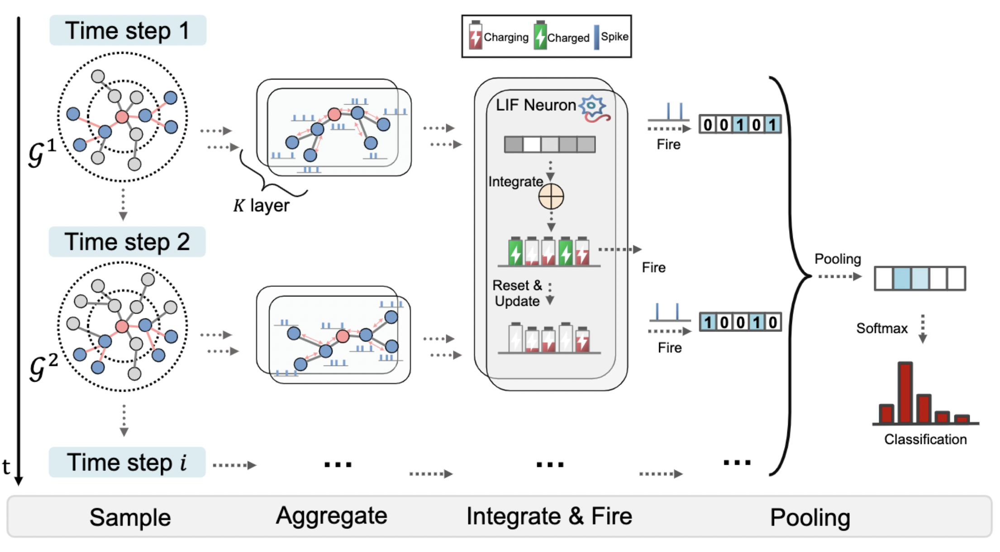

# Table of Contents
- F:\SomeProjects\SpikeNet\SpikeNet\.gitignore
- F:\SomeProjects\SpikeNet\SpikeNet\generate_feature.py
- F:\SomeProjects\SpikeNet\SpikeNet\LICENSE
- F:\SomeProjects\SpikeNet\SpikeNet\main.py
- F:\SomeProjects\SpikeNet\SpikeNet\main_static.py
- F:\SomeProjects\SpikeNet\SpikeNet\README.md
- F:\SomeProjects\SpikeNet\SpikeNet\setup.py
- F:\SomeProjects\SpikeNet\SpikeNet\spikenet\dataset.py
- F:\SomeProjects\SpikeNet\SpikeNet\spikenet\deepwalk.py
- F:\SomeProjects\SpikeNet\SpikeNet\spikenet\layers.py
- F:\SomeProjects\SpikeNet\SpikeNet\spikenet\neuron.py
- F:\SomeProjects\SpikeNet\SpikeNet\spikenet\sample_neighber.cpp
- F:\SomeProjects\SpikeNet\SpikeNet\spikenet\utils.py

## File: F:\SomeProjects\SpikeNet\SpikeNet\.gitignore

- Extension: 
- Language: unknown
- Size: 1281 bytes
- Created: 2025-09-19 00:47:53
- Modified: 2025-09-19 00:47:53

### Code

```unknown
  1 | # Custom
  2 | *.idea
  3 | *.pdf
  4 | *.txt
  5 | *.npy
  6 | !requirements.txt
  7 | data/
  8 | # Byte-compiled / optimized / DLL files
  9 | __pycache__/
 10 | *.py[cod]
 11 | *$py.class
 12 | 
 13 | # C extensions
 14 | *.so
 15 | 
 16 | # Distribution / packaging
 17 | .Python
 18 | env/
 19 | build/
 20 | develop-eggs/
 21 | dist/
 22 | downloads/
 23 | eggs/
 24 | .eggs/
 25 | lib/
 26 | lib64/
 27 | parts/
 28 | sdist/
 29 | var/
 30 | *.egg-info/
 31 | .installed.cfg
 32 | *.egg
 33 | 
 34 | # PyInstaller
 35 | #  Usually these files are written by a python script from a template
 36 | #  before PyInstaller builds the exe, so as to inject date/other infos into it.
 37 | *.manifest
 38 | *.spec
 39 | 
 40 | # Installer logs
 41 | pip-log.txt
 42 | pip-delete-this-directory.txt
 43 | 
 44 | # Unit test / coverage reports
 45 | htmlcov/
 46 | .tox/
 47 | .coverage
 48 | .coverage.*
 49 | .cache
 50 | nosetests.xml
 51 | coverage.xml
 52 | *,cover
 53 | .hypothesis/
 54 | 
 55 | # Translations
 56 | *.mo
 57 | *.pot
 58 | 
 59 | # Django stuff:
 60 | *.log
 61 | local_settings.py
 62 | 
 63 | # Flask stuff:
 64 | instance/
 65 | .webassets-cache
 66 | 
 67 | # Scrapy stuff:
 68 | .scrapy
 69 | 
 70 | # Sphinx documentation
 71 | docs/build/
 72 | 
 73 | # PyBuilder
 74 | target/
 75 | 
 76 | # IPython Notebook
 77 | .ipynb_checkpoints
 78 | 
 79 | # pyenv
 80 | .python-version
 81 | 
 82 | # celery beat schedule file
 83 | celerybeat-schedule
 84 | 
 85 | # dotenv
 86 | .env
 87 | 
 88 | # virtualenv
 89 | venv/
 90 | ENV/
 91 | 
 92 | # Spyder project settings
 93 | .spyderproject
 94 | 
 95 | # Rope project settings
 96 | .ropeproject
 97 | 
 98 | *.pickle
 99 | .vscode
100 | 
101 | # checkpoint
102 | *.h5
103 | *.pkl
104 | *.pth
105 | 
106 | # Mac files
107 | .DS_Store
```

## File: F:\SomeProjects\SpikeNet\SpikeNet\generate_feature.py

- Extension: .py
- Language: python
- Size: 1176 bytes
- Created: 2025-09-19 00:47:53
- Modified: 2025-09-19 00:47:53

### Code

```python
 1 | import argparse
 2 | 
 3 | import numpy as np
 4 | from tqdm import tqdm
 5 | 
 6 | from spikenet import dataset
 7 | from spikenet.deepwalk import DeepWalk
 8 | 
 9 | parser = argparse.ArgumentParser()
10 | parser.add_argument("--dataset", nargs="?", default="DBLP",
11 |                     help="Datasets (DBLP, Tmall, Patent). (default: DBLP)")
12 | parser.add_argument('--normalize', action='store_true',
13 |                     help='Whether to normalize output embedding. (default: False)')
14 | 
15 | 
16 | args = parser.parse_args()
17 | if args.dataset.lower() == "dblp":
18 |     data = dataset.DBLP()
19 | elif args.dataset.lower() == "tmall":
20 |     data = dataset.Tmall()
21 | elif args.dataset.lower() == "patent":
22 |     data = dataset.Patent()
23 | else:
24 |     raise ValueError(
25 |         f"{args.dataset} is invalid. Only datasets (dblp, tmall, patent) are available.")
26 | 
27 | 
28 | model = DeepWalk(80, 10, 128, window_size=10, negative=1, workers=16)
29 | xs = []
30 | for g in tqdm(data.adj):
31 |     model.fit(g)
32 |     x = model.get_embedding(normalize=args.normalize)
33 |     xs.append(x)
34 | 
35 | 
36 | file_path = f'{data.root}/{data.name}/{data.name}.npy'
37 | np.save(file_path, np.stack(xs, axis=0)) # [T, N, F]
38 | print(f"Generated node feautures saved at {file_path}")
```

## File: F:\SomeProjects\SpikeNet\SpikeNet\LICENSE

- Extension: 
- Language: unknown
- Size: 1112 bytes
- Created: 2025-09-19 00:47:53
- Modified: 2025-09-19 00:47:53

### Code

```unknown
 1 | MIT License
 2 | 
 3 | Copyright (c) 2022 Jintang Li, Sun Yat-sen University
 4 | 
 5 | Permission is hereby granted, free of charge, to any person obtaining a copy
 6 | of this software and associated documentation files (the "Software"), to deal
 7 | in the Software without restriction, including without limitation the rights
 8 | to use, copy, modify, merge, publish, distribute, sublicense, and/or sell
 9 | copies of the Software, and to permit persons to whom the Software is
10 | furnished to do so, subject to the following conditions:
11 | 
12 | The above copyright notice and this permission notice shall be included in all
13 | copies or substantial portions of the Software.
14 | 
15 | THE SOFTWARE IS PROVIDED "AS IS", WITHOUT WARRANTY OF ANY KIND, EXPRESS OR
16 | IMPLIED, INCLUDING BUT NOT LIMITED TO THE WARRANTIES OF MERCHANTABILITY,
17 | FITNESS FOR A PARTICULAR PURPOSE AND NONINFRINGEMENT. IN NO EVENT SHALL THE
18 | AUTHORS OR COPYRIGHT HOLDERS BE LIABLE FOR ANY CLAIM, DAMAGES OR OTHER
19 | LIABILITY, WHETHER IN AN ACTION OF CONTRACT, TORT OR OTHERWISE, ARISING FROM,
20 | OUT OF OR IN CONNECTION WITH THE SOFTWARE OR THE USE OR OTHER DEALINGS IN THE
21 | SOFTWARE.
```

## File: F:\SomeProjects\SpikeNet\SpikeNet\main.py

- Extension: .py
- Language: python
- Size: 9390 bytes
- Created: 2025-09-19 00:47:53
- Modified: 2025-09-19 00:47:53

### Code

```python
  1 | import argparse
  2 | import time
  3 | 
  4 | import torch
  5 | import torch.nn as nn
  6 | from sklearn import metrics
  7 | from torch.utils.data import DataLoader
  8 | from tqdm import tqdm
  9 | 
 10 | from spikenet import dataset, neuron
 11 | from spikenet.layers import SAGEAggregator
 12 | from spikenet.utils import (RandomWalkSampler, Sampler, add_selfloops,
 13 |                             set_seed, tab_printer)
 14 | 
 15 | 
 16 | class SpikeNet(nn.Module):
 17 |     def __init__(self, in_features, out_features, hids=[32], alpha=1.0, p=0.5,
 18 |                  dropout=0.7, bias=True, aggr='mean', sampler='sage',
 19 |                  surrogate='triangle', sizes=[5, 2], concat=False, act='LIF'):
 20 | 
 21 |         super().__init__()
 22 | 
 23 |         tau = 1.0
 24 |         if sampler == 'rw':
 25 |             self.sampler = [RandomWalkSampler(
 26 |                 add_selfloops(adj_matrix)) for adj_matrix in data.adj]
 27 |             self.sampler_t = [RandomWalkSampler(add_selfloops(
 28 |                 adj_matrix)) for adj_matrix in data.adj_evolve]
 29 |         elif sampler == 'sage':
 30 |             self.sampler = [Sampler(add_selfloops(adj_matrix))
 31 |                             for adj_matrix in data.adj]
 32 |             self.sampler_t = [Sampler(add_selfloops(adj_matrix))
 33 |                               for adj_matrix in data.adj_evolve]
 34 |         else:
 35 |             raise ValueError(sampler)
 36 | 
 37 |         aggregators, snn = nn.ModuleList(), nn.ModuleList()
 38 | 
 39 |         for hid in hids:
 40 |             aggregators.append(SAGEAggregator(in_features, hid,
 41 |                                               concat=concat, bias=bias,
 42 |                                               aggr=aggr))
 43 | 
 44 |             if act == "IF":
 45 |                 snn.append(neuron.IF(alpha=alpha, surrogate=surrogate))
 46 |             elif act == 'LIF':
 47 |                 snn.append(neuron.LIF(tau, alpha=alpha, surrogate=surrogate))
 48 |             elif act == 'PLIF':
 49 |                 snn.append(neuron.PLIF(tau, alpha=alpha, surrogate=surrogate))
 50 |             else:
 51 |                 raise ValueError(act)
 52 | 
 53 |             in_features = hid * 2 if concat else hid
 54 | 
 55 |         self.aggregators = aggregators
 56 |         self.dropout = nn.Dropout(dropout)
 57 |         self.snn = snn
 58 |         self.sizes = sizes
 59 |         self.p = p
 60 |         self.pooling = nn.Linear(len(data) * in_features, out_features)
 61 | 
 62 |     def encode(self, nodes):
 63 |         spikes = []
 64 |         sizes = self.sizes
 65 |         for time_step in range(len(data)):
 66 | 
 67 |             snapshot = data[time_step]
 68 |             sampler = self.sampler[time_step]
 69 |             sampler_t = self.sampler_t[time_step]
 70 | 
 71 |             x = snapshot.x
 72 |             h = [x[nodes].to(device)]
 73 |             num_nodes = [nodes.size(0)]
 74 |             nbr = nodes
 75 |             for size in sizes:
 76 |                 size_1 = max(int(size * self.p), 1)
 77 |                 size_2 = size - size_1
 78 | 
 79 |                 if size_2 > 0:
 80 |                     nbr_1 = sampler(nbr, size_1).view(nbr.size(0), size_1)
 81 |                     nbr_2 = sampler_t(nbr, size_2).view(nbr.size(0), size_2)
 82 |                     nbr = torch.cat([nbr_1, nbr_2], dim=1).flatten()
 83 |                 else:
 84 |                     nbr = sampler(nbr, size_1).view(-1)
 85 | 
 86 |                 num_nodes.append(nbr.size(0))
 87 |                 h.append(x[nbr].to(device))
 88 | 
 89 |             for i, aggregator in enumerate(self.aggregators):
 90 |                 self_x = h[:-1]
 91 |                 neigh_x = []
 92 |                 for j, n_x in enumerate(h[1:]):
 93 |                     neigh_x.append(n_x.view(-1, sizes[j], h[0].size(-1)))
 94 | 
 95 |                 out = self.snn[i](aggregator(self_x, neigh_x))
 96 |                 if i != len(sizes) - 1:
 97 |                     out = self.dropout(out)
 98 |                     h = torch.split(out, num_nodes[:-(i + 1)])
 99 | 
100 |             spikes.append(out)
101 |         spikes = torch.cat(spikes, dim=1)
102 |         neuron.reset_net(self)
103 |         return spikes
104 | 
105 |     def forward(self, nodes):
106 |         spikes = self.encode(nodes)
107 |         return self.pooling(spikes)
108 | 
109 | 
110 | parser = argparse.ArgumentParser()
111 | parser.add_argument("--dataset", nargs="?", default="DBLP",
112 |                     help="Datasets (DBLP, Tmall, Patent). (default: DBLP)")
113 | parser.add_argument('--sizes', type=int, nargs='+', default=[5, 2], help='Neighborhood sampling size for each layer. (default: [5, 2])')
114 | parser.add_argument('--hids', type=int, nargs='+',
115 |                     default=[128, 10], help='Hidden units for each layer. (default: [128, 10])')
116 | parser.add_argument("--aggr", nargs="?", default="mean",
117 |                     help="Aggregate function ('mean', 'sum'). (default: 'mean')")
118 | parser.add_argument("--sampler", nargs="?", default="sage",
119 |                     help="Neighborhood Sampler, including uniform sampler from GraphSAGE ('sage') and random walk sampler ('rw'). (default: 'sage')")
120 | parser.add_argument("--surrogate", nargs="?", default="sigmoid",
121 |                     help="Surrogate function ('sigmoid', 'triangle', 'arctan', 'mg', 'super'). (default: 'sigmoid')")
122 | parser.add_argument("--neuron", nargs="?", default="LIF",
123 |                     help="Spiking neuron used for training. (IF, LIF, PLIF). (default: LIF")
124 | parser.add_argument('--batch_size', type=int, default=1024,
125 |                     help='Batch size for training. (default: 1024)')
126 | parser.add_argument('--lr', type=float, default=5e-3,
127 |                     help='Learning rate for training. (default: 5e-3)')
128 | parser.add_argument('--train_size', type=float, default=0.4,
129 |                     help='Ratio of nodes for training. (default: 0.4)')
130 | parser.add_argument('--alpha', type=float, default=1.0,
131 |                     help='Smooth factor for surrogate learning. (default: 1.0)')
132 | parser.add_argument('--p', type=float, default=0.5,
133 |                     help='Percentage of sampled neighborhoods for g_t. (default: 0.5)')
134 | parser.add_argument('--dropout', type=float, default=0.7,
135 |                     help='Dropout probability. (default: 0.7)')
136 | parser.add_argument('--epochs', type=int, default=100,
137 |                     help='Number of training epochs. (default: 100)')
138 | parser.add_argument('--concat', action='store_true',
139 |                     help='Whether to concat node representation and neighborhood representations. (default: False)')
140 | parser.add_argument('--seed', type=int, default=2022,
141 |                     help='Random seed for model. (default: 2022)')
142 | 
143 | 
144 | try:
145 |     args = parser.parse_args()
146 |     args.test_size = 1 - args.train_size
147 |     args.train_size = args.train_size - 0.05
148 |     args.val_size = 0.05
149 |     args.split_seed = 42
150 |     tab_printer(args)
151 | except:
152 |     parser.print_help()
153 |     exit(0)
154 | 
155 | assert len(args.hids) == len(args.sizes), "must be equal!"
156 | 
157 | if args.dataset.lower() == "dblp":
158 |     data = dataset.DBLP()
159 | elif args.dataset.lower() == "tmall":
160 |     data = dataset.Tmall()
161 | elif args.dataset.lower() == "patent":
162 |     data = dataset.Patent()
163 | else:
164 |     raise ValueError(
165 |         f"{args.dataset} is invalid. Only datasets (dblp, tmall, patent) are available.")
166 | 
167 | # train:val:test
168 | data.split_nodes(train_size=args.train_size, val_size=args.val_size,
169 |                  test_size=args.test_size, random_state=args.split_seed)
170 | 
171 | set_seed(args.seed)
172 | 
173 | device = torch.device('cuda' if torch.cuda.is_available() else 'cpu')
174 | 
175 | y = data.y.to(device)
176 | 
177 | train_loader = DataLoader(data.train_nodes.tolist(), pin_memory=False, batch_size=args.batch_size, shuffle=True)
178 | val_loader = DataLoader(data.test_nodes.tolist() if data.val_nodes is None else data.val_nodes.tolist(),
179 |                         pin_memory=False, batch_size=200000, shuffle=False)
180 | test_loader = DataLoader(data.test_nodes.tolist(), pin_memory=False, batch_size=200000, shuffle=False)
181 | 
182 | model = SpikeNet(data.num_features, data.num_classes, alpha=args.alpha,
183 |                  dropout=args.dropout, sampler=args.sampler, p=args.p,
184 |                  aggr=args.aggr, concat=args.concat, sizes=args.sizes, surrogate=args.surrogate,
185 |                  hids=args.hids, act=args.neuron, bias=True).to(device)
186 | 
187 | optimizer = torch.optim.AdamW(model.parameters(), lr=args.lr)
188 | loss_fn = nn.CrossEntropyLoss()
189 | 
190 | 
191 | def train():
192 |     model.train()
193 |     for nodes in tqdm(train_loader, desc='Training'):
194 |         optimizer.zero_grad()
195 |         loss_fn(model(nodes), y[nodes]).backward()
196 |         optimizer.step()
197 | 
198 | 
199 | @torch.no_grad()
200 | def test(loader):
201 |     model.eval()
202 |     logits = []
203 |     labels = []
204 |     for nodes in loader:
205 |         logits.append(model(nodes))
206 |         labels.append(y[nodes])
207 |     logits = torch.cat(logits, dim=0).cpu()
208 |     labels = torch.cat(labels, dim=0).cpu()
209 |     logits = logits.argmax(1)
210 |     metric_macro = metrics.f1_score(labels, logits, average='macro')
211 |     metric_micro = metrics.f1_score(labels, logits, average='micro')
212 |     return metric_macro, metric_micro
213 | 
214 | 
215 | best_val_metric = test_metric = 0
216 | start = time.time()
217 | for epoch in range(1, args.epochs + 1):
218 |     train()
219 |     val_metric, test_metric = test(val_loader), test(test_loader)
220 |     if val_metric[1] > best_val_metric:
221 |         best_val_metric = val_metric[1]
222 |         best_test_metric = test_metric
223 |     end = time.time()
224 |     print(
225 |         f'Epoch: {epoch:03d}, Val: {val_metric[1]:.4f}, Test: {test_metric[1]:.4f}, Best: Macro-{best_test_metric[0]:.4f}, Micro-{best_test_metric[1]:.4f}, Time elapsed {end-start:.2f}s')
226 | 
227 | # save bianry node embeddings (spikes)
228 | # emb = model.encode(torch.arange(data.num_nodes)).cpu()
229 | # torch.save(emb, 'emb.pth')
```

## File: F:\SomeProjects\SpikeNet\SpikeNet\main_static.py

- Extension: .py
- Language: python
- Size: 8245 bytes
- Created: 2025-09-19 00:47:53
- Modified: 2025-09-19 00:47:53

### Code

```python
  1 | import argparse
  2 | import os.path as osp
  3 | import time
  4 | 
  5 | import torch
  6 | import torch.nn as nn
  7 | from sklearn import metrics
  8 | from spikenet import dataset, neuron
  9 | from spikenet.layers import SAGEAggregator
 10 | from spikenet.utils import (RandomWalkSampler, Sampler, add_selfloops,
 11 |                             set_seed, tab_printer)
 12 | from torch.utils.data import DataLoader
 13 | from torch_geometric.datasets import Flickr, Reddit
 14 | from torch_geometric.utils import to_scipy_sparse_matrix
 15 | from tqdm import tqdm
 16 | 
 17 | 
 18 | class SpikeNet(nn.Module):
 19 |     def __init__(self, in_features, out_features, hids=[32], alpha=1.0, T=5,
 20 |                  dropout=0.7, bias=True, aggr='mean', sampler='sage',
 21 |                  surrogate='triangle', sizes=[5, 2], concat=False, act='LIF'):
 22 | 
 23 |         super().__init__()
 24 | 
 25 |         tau = 1.0
 26 |         if sampler == 'rw':
 27 |             self.sampler = RandomWalkSampler(add_selfloops(to_scipy_sparse_matrix(data.edge_index)))
 28 |         elif sampler == 'sage':
 29 |             self.sampler = Sampler(add_selfloops(to_scipy_sparse_matrix(data.edge_index)))
 30 |         else:
 31 |             raise ValueError(sampler)
 32 | 
 33 |         del data.edge_index
 34 | 
 35 |         aggregators, snn = nn.ModuleList(), nn.ModuleList()
 36 | 
 37 |         for hid in hids:
 38 |             aggregators.append(SAGEAggregator(in_features, hid,
 39 |                                               concat=concat, bias=bias,
 40 |                                               aggr=aggr))
 41 | 
 42 |             if act == "IF":
 43 |                 snn.append(neuron.IF(alpha=alpha, surrogate=surrogate))
 44 |             elif act == 'LIF':
 45 |                 snn.append(neuron.LIF(tau, alpha=alpha, surrogate=surrogate))
 46 |             elif act == 'PLIF':
 47 |                 snn.append(neuron.PLIF(tau, alpha=alpha, surrogate=surrogate))
 48 |             else:
 49 |                 raise ValueError(act)
 50 | 
 51 |             in_features = hid * 2 if concat else hid
 52 | 
 53 |         self.aggregators = aggregators
 54 |         self.dropout = nn.Dropout(dropout)
 55 |         self.snn = snn
 56 |         self.sizes = sizes
 57 |         self.T = T
 58 |         self.pooling = nn.Linear(T * in_features, out_features)
 59 | 
 60 |     def encode(self, nodes):
 61 |         spikes = []
 62 |         sizes = self.sizes
 63 |         x = data.x
 64 | 
 65 |         for time_step in range(self.T):
 66 |             h = [x[nodes].to(device)]
 67 |             num_nodes = [nodes.size(0)]
 68 |             nbr = nodes
 69 |             for size in sizes:
 70 |                 nbr = self.sampler(nbr, size)
 71 |                 num_nodes.append(nbr.size(0))
 72 |                 h.append(x[nbr].to(device))
 73 | 
 74 |             for i, aggregator in enumerate(self.aggregators):
 75 |                 self_x = h[:-1]
 76 |                 neigh_x = []
 77 |                 for j, n_x in enumerate(h[1:]):
 78 |                     neigh_x.append(n_x.view(-1, sizes[j], h[0].size(-1)))
 79 | 
 80 |                 out = self.snn[i](aggregator(self_x, neigh_x))
 81 |                 if i != len(sizes) - 1:
 82 |                     out = self.dropout(out)
 83 |                     h = torch.split(out, num_nodes[:-(i + 1)])
 84 | 
 85 |             spikes.append(out)
 86 |         spikes = torch.cat(spikes, dim=1)
 87 |         neuron.reset_net(self)
 88 |         return spikes
 89 | 
 90 |     def forward(self, nodes):
 91 |         spikes = self.encode(nodes)
 92 |         return self.pooling(spikes)
 93 | 
 94 | 
 95 | parser = argparse.ArgumentParser()
 96 | parser.add_argument("--dataset", nargs="?", default="flickr",
 97 |                     help="Datasets (Reddit and Flickr only). (default: Flickr)")
 98 | parser.add_argument('--sizes', type=int, nargs='+', default=[5, 2],
 99 |                     help='Neighborhood sampling size for each layer. (default: [5, 2])')
100 | parser.add_argument('--hids', type=int, nargs='+',
101 |                     default=[512, 10], help='Hidden units for each layer. (default: [128, 10])')
102 | parser.add_argument("--aggr", nargs="?", default="mean",
103 |                     help="Aggregate function ('mean', 'sum'). (default: 'mean')")
104 | parser.add_argument("--sampler", nargs="?", default="sage",
105 |                     help="Neighborhood Sampler, including uniform sampler from GraphSAGE ('sage') and random walk sampler ('rw'). (default: 'sage')")
106 | parser.add_argument("--surrogate", nargs="?", default="sigmoid",
107 |                     help="Surrogate function ('sigmoid', 'triangle', 'arctan', 'mg', 'super'). (default: 'sigmoid')")
108 | parser.add_argument("--neuron", nargs="?", default="LIF",
109 |                     help="Spiking neuron used for training. (IF, LIF, PLIF). (default: LIF")
110 | parser.add_argument('--batch_size', type=int, default=2048,
111 |                     help='Batch size for training. (default: 1024)')
112 | parser.add_argument('--lr', type=float, default=5e-3,
113 |                     help='Learning rate for training. (default: 5e-3)')
114 | parser.add_argument('--alpha', type=float, default=1.0,
115 |                     help='Smooth factor for surrogate learning. (default: 1.0)')
116 | parser.add_argument('--T', type=int, default=15,
117 |                     help='Number of time steps. (default: 15)')
118 | parser.add_argument('--dropout', type=float, default=0.5,
119 |                     help='Dropout probability. (default: 0.5)')
120 | parser.add_argument('--epochs', type=int, default=100,
121 |                     help='Number of training epochs. (default: 100)')
122 | parser.add_argument('--concat', action='store_true',
123 |                     help='Whether to concat node representation and neighborhood representations. (default: False)')
124 | parser.add_argument('--seed', type=int, default=2022,
125 |                     help='Random seed for model. (default: 2022)')
126 | 
127 | 
128 | try:
129 |     args = parser.parse_args()
130 |     args.split_seed = 42
131 |     tab_printer(args)
132 | except:
133 |     parser.print_help()
134 |     exit(0)
135 | 
136 | assert len(args.hids) == len(args.sizes), "must be equal!"
137 | 
138 | root = "data/"  # Specify your root path
139 | 
140 | if args.dataset.lower() == "reddit":
141 |     dataset = Reddit(osp.join(root, 'Reddit'))
142 |     data = dataset[0]
143 | elif args.dataset.lower() == "flickr":
144 |     dataset = Flickr(osp.join(root, 'Flickr'))
145 |     data = dataset[0]
146 |     
147 | data.x = torch.nn.functional.normalize(data.x, dim=1)
148 | 
149 | set_seed(args.seed)
150 | 
151 | device = torch.device('cuda' if torch.cuda.is_available() else 'cpu')
152 | 
153 | y = data.y.to(device)
154 | 
155 | train_loader = DataLoader(data.train_mask.nonzero().view(-1), pin_memory=False, batch_size=args.batch_size, shuffle=True)
156 | val_loader = DataLoader(data.val_mask.nonzero().view(-1), pin_memory=False, batch_size=10000, shuffle=False)
157 | test_loader = DataLoader(data.test_mask.nonzero().view(-1), pin_memory=False, batch_size=10000, shuffle=False)
158 | 
159 | 
160 | model = SpikeNet(dataset.num_features, dataset.num_classes, alpha=args.alpha,
161 |                  dropout=args.dropout, sampler=args.sampler, T=args.T,
162 |                  aggr=args.aggr, concat=args.concat, sizes=args.sizes, surrogate=args.surrogate,
163 |                  hids=args.hids, act=args.neuron, bias=True).to(device)
164 | 
165 | optimizer = torch.optim.AdamW(model.parameters(), lr=args.lr)
166 | loss_fn = nn.CrossEntropyLoss()
167 | 
168 | 
169 | def train():
170 |     model.train()
171 |     for nodes in tqdm(train_loader, desc='Training'):
172 |         optimizer.zero_grad()
173 |         loss_fn(model(nodes), y[nodes]).backward()
174 |         optimizer.step()
175 | 
176 | 
177 | @torch.no_grad()
178 | def test(loader):
179 |     model.eval()
180 |     logits = []
181 |     labels = []
182 |     for nodes in loader:
183 |         logits.append(model(nodes))
184 |         labels.append(y[nodes])
185 |     logits = torch.cat(logits, dim=0).cpu()
186 |     labels = torch.cat(labels, dim=0).cpu()
187 |     logits = logits.argmax(1)
188 |     metric_macro = metrics.f1_score(labels, logits, average='macro')
189 |     metric_micro = metrics.f1_score(labels, logits, average='micro')
190 |     return metric_macro, metric_micro
191 | 
192 | 
193 | best_val_metric = test_metric = 0
194 | start = time.time()
195 | for epoch in range(1, args.epochs + 1):
196 |     train()
197 |     val_metric, test_metric = test(val_loader), test(test_loader)
198 |     if val_metric[1] > best_val_metric:
199 |         best_val_metric = val_metric[1]
200 |         best_test_metric = test_metric
201 |     end = time.time()
202 |     print(
203 |         f'Epoch: {epoch:03d}, Val: {val_metric[1]:.4f}, Test: {test_metric[1]:.4f}, Best: Macro-{best_test_metric[0]:.4f}, Micro-{best_test_metric[1]:.4f}, Time elapsed {end-start:.2f}s')
204 | 
205 | # save bianry node embeddings (spikes)
206 | # emb = model.encode(torch.arange(data.num_nodes)).cpu()
207 | # torch.save(emb, 'emb.pth')
```

## File: F:\SomeProjects\SpikeNet\SpikeNet\README.md

- Extension: .md
- Language: markdown
- Size: 7328 bytes
- Created: 2025-09-19 00:47:53
- Modified: 2025-09-19 00:47:53

### Code

```markdown
  1 | # SpikeNet
  2 | > [**Scaling Up Dynamic Graph Representation Learning via Spiking Neural Networks**](https://arxiv.org/abs/2208.10364) (AAAI 2023)
  3 | >
  4 | > Jintang Li, Zhouxin Yu, Zulun Zhu, Liang Chen, Qi Yu, Zibin Zheng, Sheng Tian, Ruofan Wu, Changhua Meng    
  5 | 
  6 | **This repository is an official PyTorch implementation of SpikeNet.**
  7 | <div align="center">
  8 |   
  9 | </div><br/>
 10 | 
 11 | 
 12 | # Abstract
 13 | Recent years have seen a surge in research on dynamic graph representation learning, which aims to model temporal graphs that are dynamic and evolving constantly over time. However, current work typically models graph dynamics with recurrent neural networks (RNNs), making them suffer seriously from computation and memory overheads on large temporal graphs. So far, scalability of dynamic graph representation learning on large temporal graphs remains one of the major challenges. In this paper, we present a scalable framework, namely SpikeNet, to efficiently capture the temporal and structural patterns of temporal graphs. We explore a new direction in that we can capture the evolving dynamics of temporal graphs with spiking neural networks (SNNs) instead of RNNs. As a low-power alternative to RNNs, SNNs explicitly model graph dynamics as spike trains of neuron populations and enable spike-based propagation in an efficient way. Experiments on three large real-world temporal graph datasets demonstrate that SpikeNet outperforms strong baselines on the temporal node classification task with lower computational costs. Particularly, SpikeNet generalizes to a large temporal graph (2M nodes and 13M edges) with significantly fewer parameters and computation overheads.
 14 | 
 15 | # Dataset
 16 | ## Overview
 17 | |             | DBLP    | Tmall     | Patent     |
 18 | | ----------- | ------- | --------- | ---------- |
 19 | | #nodes      | 28,085  | 577,314   | 2,738,012 |
 20 | | #edges      | 236,894 | 4,807,545 | 13,960,811 |
 21 | | #time steps | 27      | 186       | 25         |
 22 | | #classes    | 10      | 5         | 6          |
 23 | 
 24 | ## Download datasets
 25 | + DBLP
 26 | + Tmall
 27 | + Patent
 28 |   
 29 | All dataset can be found at [Dropbox](https://www.dropbox.com/sh/palzyh5box1uc1v/AACSLHB7PChT-ruN-rksZTCYa?dl=0). 
 30 | You can download the datasets and put them in the folder `data/`, e.g., `data/dblp`.
 31 | 
 32 | ## (Optional) Re-generate node features via DeepWalk
 33 | Since these datasets have no associated node features, we have generated node features via unsupervised DeepWalk method (saved as `.npy` format). 
 34 | You can find them at [Dropbox](https://www.dropbox.com/sh/palzyh5box1uc1v/AACSLHB7PChT-ruN-rksZTCYa?dl=0) as well. 
 35 | Only `dblp.npy` is uploaded due to size limit of Dropbox. 
 36 | 
 37 | (Update) The generated node features for Tmall and Patent datasets have been shared through Aliyun Drive, and the link is as follows: https://www.aliyundrive.com/s/LH9qa9XZmXa. 
 38 | 
 39 | Note: Since Aliyun Drive does not support direct sharing of npy files, you will need to manually change the file extension `.txt` to `.npy` after downloading. 
 40 | 
 41 | 
 42 | We also provide the script to generate the node features. Alternatively, you can generate them on your end (this will take about minutes to hours):
 43 | 
 44 | ```bash
 45 | python generate_feature.py --dataset dblp
 46 | python generate_feature.py --dataset tmall --normalize
 47 | python generate_feature.py --dataset patent --normalize
 48 | ```
 49 | 
 50 | ## Overall file structure
 51 | ```bash
 52 | SpikeNet
 53 | ├── data
 54 | │   ├── dblp
 55 | │   │   ├── dblp.npy
 56 | │   │   ├── dblp.txt
 57 | │   │   └── node2label.txt
 58 | │   ├── tmall
 59 | │   │   ├── tmall.npy
 60 | │   │   └── tmall.txt
 61 | │   │   ├── node2label.txt
 62 | │   ├── patent
 63 | │   │   ├── patent_edges.json
 64 | │   │   ├── patent_nodes.json
 65 | │   │   └── patent.npy
 66 | ├── figs
 67 | │   └── spikenet.png
 68 | ├── spikenet
 69 | │   ├── dataset.py
 70 | │   ├── deepwalk.py
 71 | │   ├── layers.py
 72 | │   ├── neuron.py
 73 | │   ├── sample_neighber.cpp
 74 | │   └── utils.py
 75 | ├── generate_feature.py
 76 | ├── main.py
 77 | ├── main_static.py
 78 | ├── README.md
 79 | ├── setup.py
 80 | ```
 81 | # Requirements
 82 | 
 83 | ```
 84 | tqdm==4.59.0
 85 | scipy==1.5.2
 86 | texttable==1.6.2
 87 | torch==1.9.0
 88 | numpy==1.22.4
 89 | numba==0.56.4
 90 | scikit_learn==1.0
 91 | torch_cluster (optional, only for random walk sampler)
 92 | ```
 93 | In fact, the version of these packages does not have to be consistent to ours. For example, Pytorch 1.6~-1.12 should also work.
 94 | 
 95 | 
 96 | 
 97 | # Usage
 98 | 
 99 | ## Build neighborhood sampler
100 | ```bash
101 | python setup.py install
102 | ```
103 | 
104 | ## Run SpikeNet
105 | 
106 | ```bash
107 | # DBLP
108 | python main.py --dataset dblp --hids 128 10 --batch_size 1024 --p 0.5 --train_size 0.4
109 | python main.py --dataset dblp --hids 128 10 --batch_size 1024 --p 0.5 --train_size 0.6
110 | python main.py --dataset dblp --hids 128 10 --batch_size 1024 --p 0.5 --train_size 0.8
111 | 
112 | # Tmall
113 | python main.py --dataset tmall --hids 512 10 --batch_size 1024 --p 1.0 --train_size 0.4
114 | python main.py --dataset tmall --hids 512 10 --batch_size 1024 --p 1.0 --train_size 0.6
115 | python main.py --dataset tmall --hids 512 10 --batch_size 1024 --p 1.0 --train_size 0.8
116 | 
117 | # Patent
118 | python main.py --dataset patent --hids 512 10 --batch_size 2048 --p 1.0 --train_size 0.4
119 | python main.py --dataset patent --hids 512 10 --batch_size 2048 --p 1.0 --train_size 0.6
120 | python main.py --dataset patent --hids 512 10 --batch_size 2048 --p 0.5 --train_size 0.8
121 | ```
122 | 
123 | 
124 | # On the extention to stastic graphs
125 | Actually, SpikeNet is not only applicaple for temporal graphs, it is also straightforward to extend to stastic graphs by defining a time step hyperparameter $T$ manually.
126 | In this way, the sampled subgraph at each time step naturally form graph snapshot. We can use SpikeNet to capture the *evolving* dynamics of sampled subgraphs.
127 | Due to space limit, we did not discuss this part in our paper. However, we believe this is indeed necessary to show the effectiveness of our work.
128 | 
129 | 
130 | We provide a simple example for the usage on stastic graphs datasets `Flickr` and `Reddit` (be sure you have PyTorch Geometric installed):
131 | 
132 | ```bash
133 | # Flickr
134 | python main_static.py --dataset flickr --surrogate super
135 | 
136 | # Reddit
137 | python main_static.py --dataset reddit --surrogate super
138 | ```
139 | 
140 | We report Micro-F1 score and the results are as follows:
141 | 
142 | | Method     | Flickr      | Reddit      |
143 | | ---------- | ----------- | ----------- |
144 | | GCN        | 0.492±0.003 | 0.933±0.000 |
145 | | GraphSAGE  | 0.501±0.013 | 0.953±0.001 |
146 | | FastGCN    | 0.504±0.001 | 0.924±0.001 |
147 | | S-GCN      | 0.482±0.003 | 0.964±0.001 |
148 | | AS-GCN     | 0.504±0.002 | 0.958±0.001 |
149 | | ClusterGCN | 0.481±0.005 | 0.954±0.001 |
150 | | GraphSAINT | 0.511±0.001 | 0.966±0.001 |
151 | | SpikeNet   | 0.515±0.003 | 0.953±0.001 |
152 | 
153 | # Reference
154 | ```bibtex
155 | @inproceedings{li2023scaling,
156 |   author    = {Jintang Li and
157 |                Zhouxin Yu and
158 |                Zulun Zhu and
159 |                Liang Chen and
160 |                Qi Yu and
161 |                Zibin Zheng and
162 |                Sheng Tian and
163 |                Ruofan Wu and
164 |                Changhua Meng},
165 |   title     = {Scaling Up Dynamic Graph Representation Learning via Spiking Neural
166 |                Networks},
167 |   booktitle = {{AAAI}},
168 |   pages     = {8588--8596},
169 |   publisher = {{AAAI} Press},
170 |   year      = {2023}
171 | }
172 | ```
```

## File: F:\SomeProjects\SpikeNet\SpikeNet\setup.py

- Extension: .py
- Language: python
- Size: 340 bytes
- Created: 2025-09-19 00:47:53
- Modified: 2025-09-19 00:47:53

### Code

```python
 1 | from setuptools import setup
 2 | from torch.utils.cpp_extension import BuildExtension, CppExtension
 3 | 
 4 | setup(
 5 |     name="sample_neighber",
 6 |     ext_modules=[
 7 |         CppExtension("sample_neighber", sources=["spikenet/sample_neighber.cpp"], extra_compile_args=['-g']),
 8 | 
 9 |     ],
10 |     cmdclass={
11 |         "build_ext": BuildExtension
12 |     }
13 | )
```

## File: F:\SomeProjects\SpikeNet\SpikeNet\spikenet\dataset.py

- Extension: .py
- Language: python
- Size: 11862 bytes
- Created: 2025-09-19 00:47:53
- Modified: 2025-09-19 00:47:53

### Code

```python
  1 | import math
  2 | import os.path as osp
  3 | from collections import defaultdict, namedtuple
  4 | from typing import Optional
  5 | 
  6 | import numpy as np
  7 | import scipy.sparse as sp
  8 | import torch
  9 | from sklearn import preprocessing
 10 | from sklearn.model_selection import train_test_split
 11 | from sklearn.preprocessing import LabelEncoder
 12 | from tqdm import tqdm
 13 | 
 14 | Data = namedtuple('Data', ['x', 'edge_index'])
 15 | 
 16 | 
 17 | def standard_normalization(arr):
 18 |     n_steps, n_node, n_dim = arr.shape
 19 |     arr_norm = preprocessing.scale(np.reshape(arr, [n_steps, n_node * n_dim]), axis=1)
 20 |     arr_norm = np.reshape(arr_norm, [n_steps, n_node, n_dim])
 21 |     return arr_norm
 22 | 
 23 | 
 24 | def edges_to_adj(edges, num_nodes, undirected=True):
 25 |     row, col = edges
 26 |     data = np.ones(len(row))
 27 |     N = num_nodes
 28 |     adj = sp.csr_matrix((data, (row, col)), shape=(N, N))
 29 |     if undirected:
 30 |         adj = adj.maximum(adj.T)
 31 |     adj[adj > 1] = 1
 32 |     return adj
 33 | 
 34 | 
 35 | class Dataset:
 36 |     def __init__(self, name=None, root="./data"):
 37 |         self.name = name
 38 |         self.root = root
 39 |         self.x = None
 40 |         self.y = None
 41 |         self.num_features = None
 42 |         self.adj = []
 43 |         self.adj_evolve = []
 44 |         self.edges = []
 45 |         self.edges_evolve = []
 46 | 
 47 |     def _read_feature(self):
 48 |         filename = osp.join(self.root, self.name, f"{self.name}.npy")
 49 |         if osp.exists(filename):
 50 |             return np.load(filename)
 51 |         else:
 52 |             return None
 53 | 
 54 |     def split_nodes(
 55 |         self,
 56 |         train_size: float = 0.4,
 57 |         val_size: float = 0.0,
 58 |         test_size: float = 0.6,
 59 |         random_state: Optional[int] = None,
 60 |     ):
 61 |         val_size = 0. if val_size is None else val_size
 62 |         assert train_size + val_size + test_size <= 1.0
 63 | 
 64 |         y = self.y
 65 |         train_nodes, test_nodes = train_test_split(
 66 |             torch.arange(y.size(0)),
 67 |             train_size=train_size + val_size,
 68 |             test_size=test_size,
 69 |             random_state=random_state,
 70 |             stratify=y)
 71 | 
 72 |         if val_size:
 73 |             train_nodes, val_nodes = train_test_split(
 74 |                 train_nodes,
 75 |                 train_size=train_size / (train_size + val_size),
 76 |                 random_state=random_state,
 77 |                 stratify=y[train_nodes])
 78 |         else:
 79 |             val_nodes = None
 80 | 
 81 |         self.train_nodes = train_nodes
 82 |         self.val_nodes = val_nodes
 83 |         self.test_nodes = test_nodes
 84 | 
 85 |     def split_edges(
 86 |         self,
 87 |         train_stamp: float = 0.7,
 88 |         train_size: float = None,
 89 |         val_size: float = 0.1,
 90 |         test_size: float = 0.2,
 91 |         random_state: int = None,
 92 |     ):
 93 | 
 94 |         if random_state is not None:
 95 |             torch.manual_seed(random_state)
 96 | 
 97 |         num_edges = self.edges[-1].size(-1)
 98 |         train_stamp = train_stamp if train_stamp >= 1 else math.ceil(len(self) * train_stamp)
 99 | 
100 |         train_edges = torch.LongTensor(np.hstack(self.edges_evolve[:train_stamp]))
101 |         if train_size is not None:
102 |             assert 0 < train_size < 1
103 |             num_train = math.floor(train_size * num_edges)
104 |             perm = torch.randperm(train_edges.size(1))[:num_train]
105 |             train_edges = train_edges[:, perm]
106 | 
107 |         num_val = math.floor(val_size * num_edges)
108 |         num_test = math.floor(test_size * num_edges)
109 |         testing_edges = torch.LongTensor(np.hstack(self.edges_evolve[train_stamp:]))
110 |         perm = torch.randperm(testing_edges.size(1))
111 | 
112 |         assert num_val + num_test <= testing_edges.size(1)
113 | 
114 |         self.train_stamp = train_stamp
115 |         self.train_edges = train_edges
116 |         self.val_edges = testing_edges[:, perm[:num_val]]
117 |         self.test_edges = testing_edges[:, perm[num_val:num_val + num_test]]
118 | 
119 |     def __getitem__(self, time_index: int):
120 |         x = self.x[time_index]
121 |         edge_index = self.edges[time_index]
122 |         snapshot = Data(x=x, edge_index=edge_index)
123 |         return snapshot
124 | 
125 |     def __next__(self):
126 |         if self.t < len(self):
127 |             snapshot = self.__getitem__(self.t)
128 |             self.t = self.t + 1
129 |             return snapshot
130 |         else:
131 |             self.t = 0
132 |             raise StopIteration
133 | 
134 |     def __iter__(self):
135 |         self.t = 0
136 |         return self
137 | 
138 |     def __len__(self):
139 |         return len(self.adj)
140 | 
141 |     def __repr__(self):
142 |         return self.name
143 | 
144 | 
145 | class DBLP(Dataset):
146 |     def __init__(self, root="./data", normalize=True):
147 |         super().__init__(name='dblp', root=root)
148 |         edges_evolve, self.num_nodes = self._read_graph()
149 |         x = self._read_feature()
150 |         y = self._read_label()
151 | 
152 |         if x is not None:
153 |             if normalize:
154 |                 x = standard_normalization(x)
155 |             self.num_features = x.shape[-1]
156 |             self.x = torch.FloatTensor(x)
157 | 
158 |         self.num_classes = y.max() + 1
159 | 
160 |         edges = [edges_evolve[0]]
161 |         for e_now in edges_evolve[1:]:
162 |             e_last = edges[-1]
163 |             edges.append(np.hstack([e_last, e_now]))
164 | 
165 |         self.adj = [edges_to_adj(edge, num_nodes=self.num_nodes) for edge in edges]
166 |         self.adj_evolve = [edges_to_adj(edge, num_nodes=self.num_nodes) for edge in edges_evolve]
167 |         self.edges = [torch.LongTensor(edge) for edge in edges]
168 |         self.edges_evolve = edges_evolve  # list of np.ndarray, the edges in each timestamp exist separately
169 | 
170 |         self.y = torch.LongTensor(y)
171 | 
172 |     def _read_graph(self):
173 |         filename = osp.join(self.root, self.name, f"{self.name}.txt")
174 |         d = defaultdict(list)
175 |         N = 0
176 |         with open(filename) as f:
177 |             for line in f:
178 |                 x, y, t = line.strip().split()
179 |                 x, y = int(x), int(y)
180 |                 d[t].append((x, y))
181 |                 N = max(N, x)
182 |                 N = max(N, y)
183 |         N += 1
184 |         edges = []
185 |         for time in sorted(d):
186 |             row, col = zip(*d[time])
187 |             edge_now = np.vstack([row, col])
188 |             edges.append(edge_now)
189 |         return edges, N
190 | 
191 |     def _read_label(self):
192 |         filename = osp.join(self.root, self.name, "node2label.txt")
193 |         nodes = []
194 |         labels = []
195 |         with open(filename) as f:
196 |             for line in f:
197 |                 node, label = line.strip().split()
198 |                 nodes.append(int(node))
199 |                 labels.append(label)
200 | 
201 |         nodes = np.array(nodes)
202 |         labels = LabelEncoder().fit_transform(labels)
203 | 
204 |         assert np.allclose(nodes, np.arange(nodes.size))
205 |         return labels
206 | 
207 | 
208 | def merge(edges, step=1):
209 |     if step == 1:
210 |         return edges
211 |     i = 0
212 |     length = len(edges)
213 |     out = []
214 |     while i < length:
215 |         e = edges[i:i + step]
216 |         if len(e):
217 |             out.append(np.hstack(e))
218 |         i += step
219 |     print(f'Edges has been merged from {len(edges)} timestamps to {len(out)} timestamps')
220 |     return out
221 | 
222 | 
223 | class Tmall(Dataset):
224 |     def __init__(self, root="./data", normalize=True):
225 |         super().__init__(name='tmall', root=root)
226 |         edges_evolve, self.num_nodes = self._read_graph()
227 |         x = self._read_feature()
228 | 
229 |         y, labeled_nodes = self._read_label()
230 |         # reindexing
231 |         others = set(range(self.num_nodes)) - set(labeled_nodes.tolist())
232 |         new_index = np.hstack([labeled_nodes, list(others)])
233 |         whole_nodes = np.arange(self.num_nodes)
234 |         mapping_dict = dict(zip(new_index, whole_nodes))
235 |         mapping = np.vectorize(mapping_dict.get)(whole_nodes)
236 |         edges_evolve = [mapping[e] for e in edges_evolve]
237 | 
238 |         edges_evolve = merge(edges_evolve, step=10)
239 | 
240 |         if x is not None:
241 |             if normalize:
242 |                 x = standard_normalization(x)
243 |             self.num_features = x.shape[-1]
244 |             self.x = torch.FloatTensor(x)
245 | 
246 |         self.num_classes = y.max() + 1
247 | 
248 |         edges = [edges_evolve[0]]
249 |         for e_now in edges_evolve[1:]:
250 |             e_last = edges[-1]
251 |             edges.append(np.hstack([e_last, e_now]))
252 | 
253 |         self.adj = [edges_to_adj(edge, num_nodes=self.num_nodes) for edge in edges]
254 |         self.adj_evolve = [edges_to_adj(edge, num_nodes=self.num_nodes) for edge in edges_evolve]
255 |         self.edges = [torch.LongTensor(edge) for edge in edges]
256 |         self.edges_evolve = edges_evolve  # list of np.ndarray, the edges in each timestamp exist separately
257 | 
258 |         self.mapping = mapping
259 |         self.y = torch.LongTensor(y)
260 | 
261 |     def _read_graph(self):
262 |         filename = osp.join(self.root, self.name, f"{self.name}.txt")
263 |         d = defaultdict(list)
264 |         N = 0
265 |         with open(filename) as f:
266 |             for line in tqdm(f, desc='loading edges'):
267 |                 x, y, t = line.strip().split()
268 |                 x, y = int(x), int(y)
269 |                 d[t].append((x, y))
270 |                 N = max(N, x)
271 |                 N = max(N, y)
272 |         N += 1
273 |         edges = []
274 |         for time in sorted(d):
275 |             row, col = zip(*d[time])
276 |             edge_now = np.vstack([row, col])
277 |             edges.append(edge_now)
278 |         return edges, N
279 | 
280 |     def _read_label(self):
281 |         filename = osp.join(self.root, self.name, "node2label.txt")
282 |         nodes = []
283 |         labels = []
284 |         with open(filename) as f:
285 |             for line in tqdm(f, desc='loading nodes'):
286 |                 node, label = line.strip().split()
287 |                 nodes.append(int(node))
288 |                 labels.append(label)
289 | 
290 |         labeled_nodes = np.array(nodes)
291 |         labels = LabelEncoder().fit_transform(labels)
292 |         return labels, labeled_nodes
293 | 
294 | 
295 | class Patent(Dataset):
296 |     def __init__(self, root="./data", normalize=True):
297 |         super().__init__(name='patent', root=root)
298 |         edges_evolve = self._read_graph()
299 |         y = self._read_label()
300 |         edges_evolve = merge(edges_evolve, step=2)
301 |         x = self._read_feature()
302 | 
303 |         if x is not None:
304 |             if normalize:
305 |                 x = standard_normalization(x)
306 |             self.num_features = x.shape[-1]
307 |             self.x = torch.FloatTensor(x)
308 | 
309 |         self.num_nodes = y.size
310 |         self.num_features = x.shape[-1]
311 |         self.num_classes = y.max() + 1
312 | 
313 |         edges = [edges_evolve[0]]
314 |         for e_now in edges_evolve[1:]:
315 |             e_last = edges[-1]
316 |             edges.append(np.hstack([e_last, e_now]))
317 | 
318 |         self.adj = [edges_to_adj(edge, num_nodes=self.num_nodes) for edge in edges]
319 |         self.adj_evolve = [edges_to_adj(edge, num_nodes=self.num_nodes) for edge in edges_evolve]
320 |         self.edges = [torch.LongTensor(edge) for edge in edges]
321 |         self.edges_evolve = edges_evolve  # list of np.ndarray, the edges in each timestamp exist separately
322 | 
323 |         self.x = torch.FloatTensor(x)
324 |         self.y = torch.LongTensor(y)
325 | 
326 |     def _read_graph(self):
327 |         filename = osp.join(self.root, self.name, f"{self.name}_edges.json")
328 |         time_edges = defaultdict(list)
329 |         with open(filename) as f:
330 |             for line in tqdm(f, desc='loading patent_edges'):
331 |                 # src nodeID, dst nodeID, date, src originalID, dst originalID
332 |                 src, dst, date, _, _ = eval(line)
333 |                 date = date // 1e4
334 |                 time_edges[date].append((src, dst))
335 | 
336 |         edges = []
337 |         for time in sorted(time_edges):
338 |             edges.append(np.transpose(time_edges[time]))
339 |         return edges
340 | 
341 |     def _read_label(self):
342 |         filename = osp.join(self.root, self.name, f"{self.name}_nodes.json")
343 |         labels = []
344 |         with open(filename) as f:
345 |             for line in tqdm(f, desc='loading patent_nodes'):
346 |                 # nodeID, originalID, date, node class
347 |                 node, _, date, label = eval(line)
348 |                 date = date // 1e4
349 |                 labels.append(label - 1)
350 |         labels = np.array(labels)
351 |         return labels
```

## File: F:\SomeProjects\SpikeNet\SpikeNet\spikenet\deepwalk.py

- Extension: .py
- Language: python
- Size: 5437 bytes
- Created: 2025-09-19 00:47:53
- Modified: 2025-09-19 00:47:53

### Code

```python
  1 | from distutils.version import LooseVersion
  2 | 
  3 | import gensim
  4 | import numpy as np
  5 | import scipy.sparse as sp
  6 | from gensim.models import Word2Vec as _Word2Vec
  7 | from numba import njit
  8 | from sklearn import preprocessing
  9 | 
 10 | 
 11 | class DeepWalk:
 12 |     r"""Implementation of `"DeepWalk" <https://arxiv.org/abs/1403.6652>`_
 13 |     from the KDD '14 paper "DeepWalk: Online Learning of Social Representations".
 14 |     The procedure uses random walks to approximate the pointwise mutual information
 15 |     matrix obtained by pooling normalized adjacency matrix powers. This matrix
 16 |     is decomposed by an approximate factorization technique.
 17 |     """
 18 | 
 19 |     def __init__(self, dimensions: int = 64,
 20 |                  walk_length: int = 80,
 21 |                  walk_number: int = 10,
 22 |                  workers: int = 3,
 23 |                  window_size: int = 5,
 24 |                  epochs: int = 1,
 25 |                  learning_rate: float = 0.025,
 26 |                  negative: int = 1,
 27 |                  name: str = None,
 28 |                  seed: int = None):
 29 | 
 30 |         kwargs = locals()
 31 |         kwargs.pop("self")
 32 |         kwargs.pop("__class__", None)
 33 | 
 34 |         self.set_hyparas(kwargs)
 35 | 
 36 |     def set_hyparas(self, kwargs: dict):
 37 |         for k, v in kwargs.items():
 38 |             setattr(self, k, v)
 39 |         self.hyparas = kwargs
 40 | 
 41 |     def fit(self, graph: sp.csr_matrix):
 42 |         walks = RandomWalker(walk_length=self.walk_length,
 43 |                              walk_number=self.walk_number).walk(graph)
 44 |         sentences = [list(map(str, walk)) for walk in walks]
 45 |         model = Word2Vec(sentences,
 46 |                          sg=1,
 47 |                          hs=0,
 48 |                          alpha=self.learning_rate,
 49 |                          iter=self.epochs,
 50 |                          size=self.dimensions,
 51 |                          window=self.window_size,
 52 |                          workers=self.workers,
 53 |                          negative=self.negative,
 54 |                          seed=self.seed)
 55 |         self._embedding = model.get_embedding()
 56 | 
 57 |     def get_embedding(self, normalize=True) -> np.array:
 58 |         """Getting the node embedding."""
 59 |         embedding = self._embedding
 60 |         if normalize:
 61 |             embedding = preprocessing.normalize(embedding)
 62 |         return embedding
 63 | 
 64 | 
 65 | class RandomWalker:
 66 |     """Fast first-order random walks in DeepWalk
 67 | 
 68 |     Parameters:
 69 |     -----------
 70 |     walk_number (int): Number of random walks. Default is 10.
 71 |     walk_length (int): Length of random walks. Default is 80.
 72 |     """
 73 | 
 74 |     def __init__(self, walk_length: int = 80, walk_number: int = 10):
 75 |         self.walk_length = walk_length
 76 |         self.walk_number = walk_number
 77 | 
 78 |     def walk(self, graph: sp.csr_matrix):
 79 |         walks = self.random_walk(graph.indices,
 80 |                                  graph.indptr,
 81 |                                  walk_length=self.walk_length,
 82 |                                  walk_number=self.walk_number)
 83 |         return walks
 84 | 
 85 |     @staticmethod
 86 |     @njit(nogil=True)
 87 |     def random_walk(indices,
 88 |                     indptr,
 89 |                     walk_length,
 90 |                     walk_number):
 91 |         N = len(indptr) - 1
 92 |         for _ in range(walk_number):
 93 |             for n in range(N):
 94 |                 walk = [n]
 95 |                 current_node = n
 96 |                 for _ in range(walk_length - 1):
 97 |                     neighbors = indices[
 98 |                         indptr[current_node]:indptr[current_node + 1]]
 99 |                     if neighbors.size == 0:
100 |                         break
101 |                     current_node = np.random.choice(neighbors)
102 |                     walk.append(current_node)
103 | 
104 |                 yield walk
105 | 
106 | 
107 | class Word2Vec(_Word2Vec):
108 |     """A compatible version of Word2Vec"""
109 | 
110 |     def __init__(self, sentences=None, sg=0, hs=0, alpha=0.025, iter=5, size=100, window=5, workers=3, negative=5, seed=None, **kwargs):
111 |         if LooseVersion(gensim.__version__) <= LooseVersion("4.0.0"):
112 |             super().__init__(sentences,
113 |                              size=size,
114 |                              window=window,
115 |                              min_count=0,
116 |                              alpha=alpha,
117 |                              sg=sg,
118 |                              workers=workers,
119 |                              iter=iter,
120 |                              negative=negative,
121 |                              hs=hs,
122 |                              compute_loss=True,
123 |                              seed=seed, **kwargs)
124 | 
125 |         else:
126 |             super().__init__(sentences,
127 |                              vector_size=size,
128 |                              window=window,
129 |                              min_count=0,
130 |                              alpha=alpha,
131 |                              sg=sg,
132 |                              workers=workers,
133 |                              epochs=iter,
134 |                              negative=negative,
135 |                              hs=hs,
136 |                              compute_loss=True,
137 |                              seed=seed, **kwargs)
138 | 
139 |     def get_embedding(self):
140 |         if LooseVersion(gensim.__version__) <= LooseVersion("4.0.0"):
141 |             embedding = self.wv.vectors[np.fromiter(
142 |                 map(int, self.wv.index2word), np.int32).argsort()]
143 |         else:
144 |             embedding = self.wv.vectors[np.fromiter(
145 |                 map(int, self.wv.index_to_key), np.int32).argsort()]
146 | 
147 |         return embedding
```

## File: F:\SomeProjects\SpikeNet\SpikeNet\spikenet\layers.py

- Extension: .py
- Language: python
- Size: 1263 bytes
- Created: 2025-09-19 00:47:53
- Modified: 2025-09-19 00:47:53

### Code

```python
 1 | import torch
 2 | import torch.nn as nn
 3 | 
 4 | 
 5 | class SAGEAggregator(nn.Module):
 6 |     def __init__(self, in_features, out_features,
 7 |                  aggr='mean',
 8 |                  concat=False,
 9 |                  bias=False):
10 | 
11 |         super().__init__()
12 |         self.in_features = in_features
13 |         self.out_features = out_features
14 |         self.concat = concat
15 | 
16 |         self.aggr = aggr
17 |         self.aggregator = {'mean': torch.mean, 'sum': torch.sum}[aggr]
18 | 
19 |         self.lin_l = nn.Linear(in_features, out_features, bias=bias)
20 |         self.lin_r = nn.Linear(in_features, out_features, bias=bias)
21 | 
22 |     def forward(self, x, neigh_x):
23 |         if not isinstance(x, torch.Tensor):
24 |             x = torch.cat(x, dim=0)
25 | 
26 |         if not isinstance(neigh_x, torch.Tensor):
27 |             neigh_x = torch.cat([self.aggregator(h, dim=1)
28 |                                 for h in neigh_x], dim=0)
29 |         else:
30 |             neigh_x = self.aggregator(neigh_x, dim=1)
31 | 
32 |         x = self.lin_l(x)
33 |         neigh_x = self.lin_r(neigh_x)
34 |         out = torch.cat([x, neigh_x], dim=1) if self.concat else x + neigh_x
35 |         return out
36 | 
37 |     def __repr__(self):
38 |         return f"{self.__class__.__name__}({self.in_features}, {self.out_features}, aggr={self.aggr})"
```

## File: F:\SomeProjects\SpikeNet\SpikeNet\spikenet\neuron.py

- Extension: .py
- Language: python
- Size: 7039 bytes
- Created: 2025-09-19 00:47:53
- Modified: 2025-09-19 00:47:53

### Code

```python
  1 | from math import pi
  2 | 
  3 | import torch
  4 | import torch.nn as nn
  5 | 
  6 | gamma = 0.2
  7 | thresh_decay = 0.7
  8 | 
  9 | 
 10 | def reset_net(net: nn.Module):
 11 |     for m in net.modules():
 12 |         if hasattr(m, 'reset'):
 13 |             m.reset()
 14 | 
 15 | 
 16 | def heaviside(x: torch.Tensor):
 17 |     return x.ge(0)
 18 | 
 19 | 
 20 | def gaussian(x, mu, sigma):
 21 |     """
 22 |     Gaussian PDF with broadcasting.
 23 |     """
 24 |     return torch.exp(-((x - mu) * (x - mu)) / (2 * sigma * sigma)) / (sigma * torch.sqrt(2 * torch.tensor(pi)))
 25 | 
 26 | 
 27 | class BaseSpike(torch.autograd.Function):
 28 |     """
 29 |     Baseline spiking function.
 30 |     """
 31 | 
 32 |     @staticmethod
 33 |     def forward(ctx, x, alpha):
 34 |         ctx.save_for_backward(x, alpha)
 35 |         return x.gt(0).float()
 36 | 
 37 |     @staticmethod
 38 |     def backward(ctx, grad_output):
 39 |         raise NotImplementedError
 40 | 
 41 | 
 42 | class SuperSpike(BaseSpike):
 43 |     """
 44 |     Spike function with SuperSpike surrogate gradient from
 45 |     "SuperSpike: Supervised Learning in Multilayer Spiking Neural Networks", Zenke et al. 2018.
 46 | 
 47 |     Design choices:
 48 |     - Height of 1 ("The Remarkable Robustness of Surrogate Gradient...", Zenke et al. 2021)
 49 |     - alpha scaled by 10 ("Training Deep Spiking Neural Networks", Ledinauskas et al. 2020)
 50 |     """
 51 | 
 52 |     @staticmethod
 53 |     def backward(ctx, grad_output):
 54 |         x, alpha = ctx.saved_tensors
 55 |         grad_input = grad_output.clone()
 56 |         sg = 1 / (1 + alpha * x.abs()) ** 2
 57 |         return grad_input * sg, None
 58 | 
 59 | 
 60 | class MultiGaussSpike(BaseSpike):
 61 |     """
 62 |     Spike function with multi-Gaussian surrogate gradient from
 63 |     "Accurate and efficient time-domain classification...", Yin et al. 2021.
 64 | 
 65 |     Design choices:
 66 |     - Hyperparameters determined through grid search (Yin et al. 2021)
 67 |     """
 68 | 
 69 |     @staticmethod
 70 |     def backward(ctx, grad_output):
 71 |         x, alpha = ctx.saved_tensors
 72 |         grad_input = grad_output.clone()
 73 |         zero = torch.tensor(0.0)  # no need to specify device for 0-d tensors
 74 |         sg = (
 75 |             1.15 * gaussian(x, zero, alpha)
 76 |             - 0.15 * gaussian(x, alpha, 6 * alpha)
 77 |             - 0.15 * gaussian(x, -alpha, 6 * alpha)
 78 |         )
 79 |         return grad_input * sg, None
 80 | 
 81 | 
 82 | class TriangleSpike(BaseSpike):
 83 |     """
 84 |     Spike function with triangular surrogate gradient
 85 |     as in Bellec et al. 2020.
 86 |     """
 87 | 
 88 |     @staticmethod
 89 |     def backward(ctx, grad_output):
 90 |         x, alpha = ctx.saved_tensors
 91 |         grad_input = grad_output.clone()
 92 |         sg = torch.nn.functional.relu(1 - alpha * x.abs())
 93 |         return grad_input * sg, None
 94 | 
 95 | 
 96 | class ArctanSpike(BaseSpike):
 97 |     """
 98 |     Spike function with derivative of arctan surrogate gradient.
 99 |     Featured in Fang et al. 2020/2021.
100 |     """
101 | 
102 |     @staticmethod
103 |     def backward(ctx, grad_output):
104 |         x, alpha = ctx.saved_tensors
105 |         grad_input = grad_output.clone()
106 |         sg = 1 / (1 + alpha * x * x)
107 |         return grad_input * sg, None
108 | 
109 | 
110 | class SigmoidSpike(BaseSpike):
111 | 
112 |     @staticmethod
113 |     def backward(ctx, grad_output):
114 |         x, alpha = ctx.saved_tensors
115 |         grad_input = grad_output.clone()
116 |         sgax = (x * alpha).sigmoid_()
117 |         sg = (1. - sgax) * sgax * alpha
118 |         return grad_input * sg, None
119 | 
120 | 
121 | def superspike(x, thresh=torch.tensor(1.0), alpha=torch.tensor(10.0)):
122 |     return SuperSpike.apply(x - thresh, alpha)
123 | 
124 | 
125 | def mgspike(x, thresh=torch.tensor(1.0), alpha=torch.tensor(0.5)):
126 |     return MultiGaussSpike.apply(x - thresh, alpha)
127 | 
128 | 
129 | def sigmoidspike(x, thresh=torch.tensor(1.0), alpha=torch.tensor(1.0)):
130 |     return SigmoidSpike.apply(x - thresh, alpha)
131 | 
132 | 
133 | def trianglespike(x, thresh=torch.tensor(1.0), alpha=torch.tensor(1.0)):
134 |     return TriangleSpike.apply(x - thresh, alpha)
135 | 
136 | 
137 | def arctanspike(x, thresh=torch.tensor(1.0), alpha=torch.tensor(10.0)):
138 |     return ArctanSpike.apply(x - thresh, alpha)
139 | 
140 | 
141 | SURROGATE = {'sigmoid': sigmoidspike, 'triangle': trianglespike, 'arctan': arctanspike,
142 |              'mg': mgspike, 'super': superspike}
143 | 
144 | 
145 | class IF(nn.Module):
146 |     def __init__(self, v_threshold=1.0, v_reset=0., alpha=1.0, surrogate='triangle'):
147 |         super().__init__()
148 |         self.v_threshold = v_threshold
149 |         self.v_reset = v_reset
150 |         self.surrogate = SURROGATE.get(surrogate)
151 |         self.register_buffer("alpha", torch.as_tensor(
152 |             alpha, dtype=torch.float32))
153 |         self.reset()
154 | 
155 |     def reset(self):
156 |         self.v = 0.
157 |         self.v_th = self.v_threshold
158 | 
159 |     def forward(self, dv):
160 |         # 1. charge
161 |         self.v += dv
162 |         # 2. fire
163 |         spike = self.surrogate(self.v, self.v_threshold, self.alpha)
164 |         # 3. reset
165 |         self.v = (1 - spike) * self.v + spike * self.v_reset
166 |         # 4. threhold updates
167 |         # Calculate change in cell's threshold based on a fixed decay factor and incoming spikes.
168 |         self.v_th = gamma * spike + self.v_th * thresh_decay
169 |         return spike
170 | 
171 | 
172 | class LIF(nn.Module):
173 |     def __init__(self, tau=1.0, v_threshold=1.0, v_reset=0., alpha=1.0, surrogate='triangle'):
174 |         super().__init__()
175 |         self.v_threshold = v_threshold
176 |         self.v_reset = v_reset
177 |         self.surrogate = SURROGATE.get(surrogate)
178 |         self.register_buffer("tau", torch.as_tensor(tau, dtype=torch.float32))
179 |         self.register_buffer("alpha", torch.as_tensor(
180 |             alpha, dtype=torch.float32))
181 |         self.reset()
182 | 
183 |     def reset(self):
184 |         self.v = 0.
185 |         self.v_th = self.v_threshold
186 | 
187 |     def forward(self, dv):
188 |         # 1. charge
189 |         self.v = self.v + (dv - (self.v - self.v_reset)) / self.tau
190 |         # 2. fire
191 |         spike = self.surrogate(self.v, self.v_th, self.alpha)
192 |         # 3. reset
193 |         self.v = (1 - spike) * self.v + spike * self.v_reset
194 |         # 4. threhold updates
195 |         # Calculate change in cell's threshold based on a fixed decay factor and incoming spikes.
196 |         self.v_th = gamma * spike + self.v_th * thresh_decay
197 |         return spike
198 | 
199 | 
200 | class PLIF(nn.Module):
201 |     def __init__(self, tau=1.0, v_threshold=1.0, v_reset=0., alpha=1.0, surrogate='triangle'):
202 |         super().__init__()
203 |         self.v_threshold = v_threshold
204 |         self.v_reset = v_reset
205 |         self.surrogate = SURROGATE.get(surrogate)
206 |         self.register_parameter("tau", nn.Parameter(
207 |             torch.as_tensor(tau, dtype=torch.float32)))
208 |         self.register_buffer("alpha", torch.as_tensor(
209 |             alpha, dtype=torch.float32))
210 |         self.reset()
211 | 
212 |     def reset(self):
213 |         self.v = 0.
214 |         self.v_th = self.v_threshold
215 | 
216 |     def forward(self, dv):
217 |         # 1. charge
218 |         self.v = self.v + (dv - (self.v - self.v_reset)) / self.tau
219 |         # 2. fire
220 |         spike = self.surrogate(self.v, self.v_th, self.alpha)
221 |         # 3. reset
222 |         self.v = (1 - spike) * self.v + spike * self.v_reset
223 |         # 4. threhold updates
224 |         # Calculate change in cell's threshold based on a fixed decay factor and incoming spikes.
225 |         self.v_th = gamma * spike + self.v_th * thresh_decay
226 |         return spike
```

## File: F:\SomeProjects\SpikeNet\SpikeNet\spikenet\sample_neighber.cpp

- Extension: .cpp
- Language: cpp
- Size: 5828 bytes
- Created: 2025-09-19 00:47:53
- Modified: 2025-09-19 00:47:53

### Code

```cpp
  1 | #include <torch/extension.h>
  2 | #define CHECK_CPU(x) AT_ASSERTM(x.device().is_cpu(), #x " must be CPU tensor")
  3 | #define CHECK_INPUT(x) AT_ASSERTM(x, "Input mismatch")
  4 | 
  5 | #define AT_DISPATCH_HAS_VALUE(optional_value, ...) \
  6 |     [&] {                                          \
  7 |         if (optional_value.has_value())            \
  8 |         {                                          \
  9 |             const bool HAS_VALUE = true;           \
 10 |             return __VA_ARGS__();                  \
 11 |         }                                          \
 12 |         else                                       \
 13 |         {                                          \
 14 |             const bool HAS_VALUE = false;          \
 15 |             return __VA_ARGS__();                  \
 16 |         }                                          \
 17 |     }()
 18 | 
 19 | torch::Tensor sample_neighber_cpu(torch::Tensor rowptr, torch::Tensor col, torch::Tensor idx,
 20 |                int64_t num_neighbors, bool replace);
 21 | 
 22 | // Returns `rowptr`, `col`, `n_id`, `e_id`
 23 | torch::Tensor sample_neighber_cpu(torch::Tensor rowptr, torch::Tensor col, torch::Tensor idx,
 24 |                int64_t num_neighbors, bool replace)
 25 | {
 26 |     CHECK_CPU(rowptr);
 27 |     CHECK_CPU(col);
 28 |     CHECK_CPU(idx);
 29 |     CHECK_INPUT(idx.dim() == 1);
 30 | 
 31 |     auto rowptr_data = rowptr.data_ptr<int64_t>();
 32 |     auto col_data = col.data_ptr<int64_t>();
 33 |     auto idx_data = idx.data_ptr<int64_t>();
 34 | 
 35 |     std::vector<int64_t> n_ids;
 36 | 
 37 |     int64_t i;
 38 |     
 39 | 
 40 |     int64_t n, c, e, row_start, row_end, row_count;
 41 | 
 42 |     if (num_neighbors < 0)
 43 |     { // No sampling ======================================
 44 | 
 45 |         for (int64_t i = 0; i < idx.numel(); i++)
 46 |         {
 47 |             n = idx_data[i];
 48 |             row_start = rowptr_data[n], row_end = rowptr_data[n + 1];
 49 |             row_count = row_end - row_start;
 50 | 
 51 |             for (int64_t j = 0; j < row_count; j++)
 52 |             {
 53 |                 e = row_start + j;
 54 |                 c = col_data[e];
 55 |                 n_ids.push_back(c);
 56 |             }
 57 |         }
 58 |     }
 59 | 
 60 |     else if (replace)
 61 |     { // Sample with replacement ===============================
 62 |         for (int64_t i = 0; i < idx.numel(); i++)
 63 |         {
 64 |             n = idx_data[i];
 65 |             row_start = rowptr_data[n], row_end = rowptr_data[n + 1];
 66 |             row_count = row_end - row_start;
 67 | 
 68 |             std::unordered_set<int64_t> perm;
 69 |             if (row_count <= num_neighbors)
 70 |             {
 71 |                 for (int64_t j = 0; j < row_count; j++)
 72 |                     perm.insert(j);
 73 |                 for (int64_t j = 0; j < num_neighbors-row_count; j++){
 74 |                     e = row_start + rand() % row_count;
 75 |                     c = col_data[e];
 76 |                     n_ids.push_back(c);
 77 |                 }
 78 |             }
 79 |             else
 80 |             { // See: https://www.nowherenearithaca.com/2013/05/
 81 |                 //      robert-floyds-tiny-and-beautiful.html
 82 |                 for (int64_t j = row_count - num_neighbors; j < row_count; j++)
 83 |                 {
 84 |                     if (!perm.insert(rand() % j).second)
 85 |                         perm.insert(j);
 86 |                 }
 87 |             }
 88 | 
 89 |             
 90 |             for (const int64_t &p : perm)
 91 |             {
 92 |                 e = row_start + p;
 93 |                 c = col_data[e];
 94 |                 n_ids.push_back(c);
 95 |             }
 96 |             
 97 |         }
 98 |         // for (int64_t i = 0; i < idx.numel(); i++)
 99 |         // {
100 |         //     n = idx_data[i];
101 |         //     row_start = rowptr_data[n], row_end = rowptr_data[n + 1];
102 |         //     row_count = row_end - row_start;
103 |         //     // std::vector<int64_t>().swap(temp);
104 |         //     // for (int64_t j = 0; j < row_count; j++)
105 |         //     // {
106 |         //     //     temp.push_back(j);
107 |         //     // }
108 |         //     // if (row_count<num_neighbors){
109 |         //     //     for (int64_t j = 0; j <num_neighbors-row_count; j++){
110 |         //     //         temp.push_back(rand() % row_count);
111 |         //     //     }
112 |         //     // }
113 |         //     // std::random_shuffle(temp.begin(), temp.end());
114 |         //     std::unordered_set<int64_t> perm;
115 |         //     for (int64_t j = 0; j < num_neighbors; j++)
116 |         //     {
117 |         //         e = row_start + rand() % row_count;
118 |         //         // e = row_start + temp[j];
119 |         //         c = col_data[e];
120 |         //         n_ids.push_back(c);
121 |         //     }
122 |         // }
123 |     }
124 |     else
125 |     { // Sample without replacement via Robert Floyd algorithm ============
126 | 
127 |         for (int64_t i = 0; i < idx.numel(); i++)
128 |         {
129 |             n = idx_data[i];
130 |             row_start = rowptr_data[n], row_end = rowptr_data[n + 1];
131 |             row_count = row_end - row_start;
132 | 
133 |             std::unordered_set<int64_t> perm;
134 |             if (row_count <= num_neighbors)
135 |             {
136 |                 for (int64_t j = 0; j < row_count; j++)
137 |                     perm.insert(j);
138 |             }
139 |             else
140 |             { // See: https://www.nowherenearithaca.com/2013/05/
141 |                 //      robert-floyds-tiny-and-beautiful.html
142 |                 for (int64_t j = row_count - num_neighbors; j < row_count; j++)
143 |                 {
144 |                     if (!perm.insert(rand() % j).second)
145 |                         perm.insert(j);
146 |                 }
147 |             }
148 | 
149 |             for (const int64_t &p : perm)
150 |             {
151 |                 e = row_start + p;
152 |                 c = col_data[e];
153 |                 n_ids.push_back(c);
154 |             }
155 |         }
156 |     }
157 | 
158 |     int64_t N = n_ids.size();
159 |     auto out_n_id = torch::from_blob(n_ids.data(), {N}, col.options()).clone();
160 | 
161 |     return out_n_id;
162 | }
163 | PYBIND11_MODULE(TORCH_EXTENSION_NAME, m){
164 |     m.def("sample_neighber_cpu", &sample_neighber_cpu, "Node neighborhood sampler");
165 | }
```

## File: F:\SomeProjects\SpikeNet\SpikeNet\spikenet\utils.py

- Extension: .py
- Language: python
- Size: 2759 bytes
- Created: 2025-09-19 00:47:53
- Modified: 2025-09-19 00:47:53

### Code

```python
 1 | import numpy as np
 2 | import scipy.sparse as sp
 3 | import torch
 4 | from sample_neighber import sample_neighber_cpu
 5 | from texttable import Texttable
 6 | 
 7 | try:
 8 |     import torch_cluster
 9 | except ImportError:
10 |     torch_cluster = None
11 | 
12 | 
13 | def set_seed(seed):
14 |     np.random.seed(seed)
15 |     torch.manual_seed(seed)
16 |     torch.cuda.manual_seed(seed)
17 | 
18 | def tab_printer(args):
19 |     """Function to print the logs in a nice tabular format.
20 |     
21 |     Note
22 |     ----
23 |     Package `Texttable` is required.
24 |     Run `pip install Texttable` if was not installed.
25 |     
26 |     Parameters
27 |     ----------
28 |     args: Parameters used for the model.
29 |     """
30 |     args = vars(args)
31 |     keys = sorted(args.keys())
32 |     t = Texttable() 
33 |     t.add_rows([["Parameter", "Value"]] +  [[k.replace("_"," "), args[k]] for k in keys])
34 |     print(t.draw())
35 | 
36 |     
37 | class Sampler:
38 |     def __init__(self, adj_matrix: sp.csr_matrix):
39 |         self.rowptr = torch.LongTensor(adj_matrix.indptr)
40 |         self.col = torch.LongTensor(adj_matrix.indices)
41 | 
42 |     def __call__(self, nodes, size, replace=True):
43 |         nbr = sample_neighber_cpu(self.rowptr, self.col, nodes, size, replace)
44 |         return nbr
45 |     
46 |     
47 | class RandomWalkSampler:
48 |     def __init__(self, adj_matrix: sp.csr_matrix, p: float = 1.0, q: float = 1.0):
49 |         self.rowptr = torch.LongTensor(adj_matrix.indptr)
50 |         self.col = torch.LongTensor(adj_matrix.indices)
51 |         self.p = p
52 |         self.q = q
53 |         assert torch_cluster, "Please install 'torch_cluster' first."
54 | 
55 |     def __call__(self, nodes, size, replace=True):
56 |         nbr = torch.ops.torch_cluster.random_walk(self.rowptr, self.col, nodes, size, self.p, self.q)[0][:, 1:] 
57 |         return nbr
58 | 
59 | 
60 | def eliminate_selfloops(adj_matrix):
61 |     """eliminate selfloops for adjacency matrix.
62 | 
63 |     >>>eliminate_selfloops(adj) # return an adjacency matrix without selfloops
64 | 
65 |     Parameters
66 |     ----------
67 |     adj_matrix: Scipy matrix or Numpy array
68 | 
69 |     Returns
70 |     -------
71 |     Single Scipy sparse matrix or Numpy matrix.
72 | 
73 |     """
74 |     if sp.issparse(adj_matrix):
75 |         adj_matrix = adj_matrix - sp.diags(adj_matrix.diagonal(), format='csr')
76 |         adj_matrix.eliminate_zeros()
77 |     else:
78 |         adj_matrix = adj_matrix - np.diag(adj_matrix)
79 |     return adj_matrix
80 | 
81 | 
82 | def add_selfloops(adj_matrix: sp.csr_matrix):
83 |     """add selfloops for adjacency matrix.
84 | 
85 |     >>>add_selfloops(adj) # return an adjacency matrix with selfloops
86 | 
87 |     Parameters
88 |     ----------
89 |     adj_matrix: Scipy matrix or Numpy array
90 | 
91 |     Returns
92 |     -------
93 |     Single sparse matrix or Numpy matrix.
94 | 
95 |     """
96 |     adj_matrix = eliminate_selfloops(adj_matrix)
97 | 
98 |     return adj_matrix + sp.eye(adj_matrix.shape[0], dtype=adj_matrix.dtype, format='csr')
```

